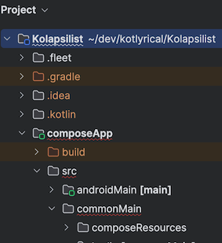

# MateriallyMessy
Frustratedly stupid little testbed to explore issues related to getting extended Material icons.

Isolating from other projects such as Kolapsilist so as to not delay them and also with a simplified scope of a pure Android Kotlin Compose app vs multi-platform.

Written very iteratively from a _naive viewpoint_ showing what needed to change for each simple step, rather than dropping in a bunch of GPT-generated code.

See edit details in `MateriallyMessy Code Change Diary.md`

## Creation
Project created following [Android docs][a1] using _Empty Activity_ template
- Project Name: MateriallyMessy
- id: com.aussie.materiallymessy
- Min SDK API 28

[a1]: https://developer.android.com/develop/ui/compose/setup


## Extended Material Icons

### Including icons directly
Preferred approach on main - [import the icons directly][as1], to avoid build hits.

There are a few gotchas and a lot of **outdated advice saying this doesn't work** and that you need per-platform icons.

Although not needed here, including notes because this was a pain to resolve!

For either case, you 
1. Download the SVG
2. Use [Vector Asset Studio in Android Studio][as2] to convert them to a _Vector Drawable_ which, for historical reasons, doesn't have a sensible extension indicating they are such, just the generic `.xml`.

The guide above walks you through adding the files in a `drawable` folder.

#### Where to put icons
For a pure Android project such as MateriallyMessy, that will be at a path like `app/res/drawable`.

For a Compose project, the path will be like `app/composeApp/src/commonMain/composeResources`.

The `composeResources` directory may not appear - **DON'T PANIC**

In Android Studio, ensure **Project** view top pulldown says *Project* (which reflects the file structure) and not *Android*. 




#### How to use icons
When you have included icons and re-synched Gradle, there are top-level _resource packages_ available for use in your code, without adding an explicit import.

The **only** difference in how you use the icons is the name of the top level package

For pure Jetpack in Android - use package **R**

```
Icon(
	//Icons.Rounded.Print, from material extended, used as local copy
	painter = painterResource(R.drawable.print),
	contentDescription = "print"
)
```            

For Compose - use package **Res**

```
Icon(
	//Icons.Rounded.Print, from material extended, used as local copy
	painter = painterResource(Res.drawable.print),
	contentDescription = "print"
)
```            


### Importing all extended icon definitions - alternative build approach
The branch `ImportingAllExtendedIcons` uses an approach that is _officially discouraged_ on the [Maven repository][m1] but is regularly used in many of the official [jetpack compose samples][g1].

As they warn, it's notably a hit on build times, seen in the [branch which tried this approach][gh1]:

```
> Task :prepareKotlinBuildScriptModel UP-TO-DATE
Download https://dl.google.com/dl/android/maven2/androidx/compose/material/material-icons-extended/1.6.6/material-icons-extended-1.6.6.pom, took 1 s 949 ms
Download https://dl.google.com/dl/android/maven2/androidx/compose/material/material-icons-extended/1.6.6/material-icons-extended-1.6.6.module, took 1 s 176 ms
Download https://dl.google.com/dl/android/maven2/androidx/compose/material/material-icons-extended-android/1.6.6/material-icons-extended-android-1.6.6.pom, took 864 ms
Download https://dl.google.com/dl/android/maven2/androidx/compose/material/material-icons-extended-android/1.6.6/material-icons-extended-android-1.6.6.module, took 477 ms
Download https://dl.google.com/dl/android/maven2/androidx/compose/material/material-icons-extended-android/1.6.6/material-icons-extended-android-1.6.6.aar, took 17 s 180 ms
Download https://dl.google.com/dl/android/maven2/androidx/compose/material/material-icons-extended-android/1.6.6/material-icons-extended-android-1.6.6-sources.jar, took 10 s 224 ms

BUILD SUCCESSFUL in 41s
```

[as1]: https://developer.android.com/studio/write/vector-asset-studio#materialicon
[as2]: https://developer.android.com/studio/write/vector-asset-studio#running
[m1]: https://developer.android.com/reference/kotlin/androidx/compose/material/icons/package-summary
[g1]: https://github.com/android/compose-samples
[g2]: https://issuetracker.google.com/issues/323537650
[gh1]: https://github.com/AndyDentFree/kotlyrical/tree/ImportingAllExtendedIcons